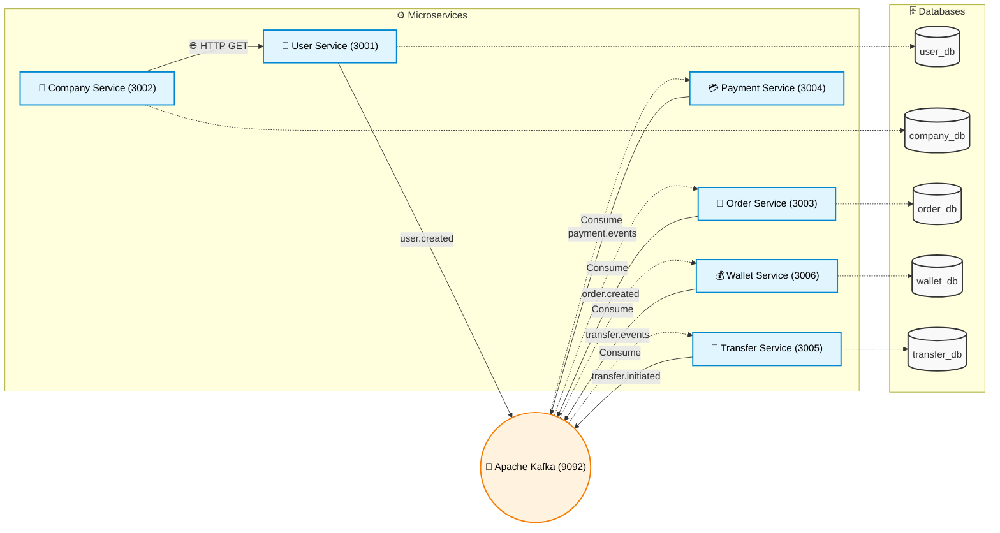

# Microservices Architecture Workshop

Bu proje, modern mikroservis mimarisinde karşılaşılan temel zorlukları (veri tutarlılığı, servisler arası iletişim, dağıtık işlemler vb.) çözmek ve pratik yapmak amacıyla oluşturulmuş bir test ortamıdır.

## 🚀 Kullanılan Teknolojiler

- **Backend:** Node.js, Express.js
- **Veritabanı:** PostgreSQL (Tek bir instance üzerinde izole edilmiş 5 farklı veritabanı)
- **Mesaj Kuyruğu (Message Broker):** Apache Kafka
- **Konteynerleştirme:** Docker & Docker Compose

---

## 🏗️ Mimari Şema

Aşağıdaki şemada, servislerin birbiriyle nasıl iletişim kurduğu ve Kafka Topic'lerinin nasıl konumlandığı gösterilmektedir:



---

## 🗄️ Veritabanı Şemaları (Database Schemas)

Sistemdeki her bir mikroservis kendi izole veritabanına ve tablolarına sahiptir. 

### 1. user_db (`User Service`)
| Tablo Adı | Kolonlar | Açıklama |
| :--- | :--- | :--- |
| `users` | `id` (PK), `username`, `email`, `created_at` | Sistemdeki temel kullanıcı bilgilerini tutar. |

### 2. company_db (`Company Service`)
| Tablo Adı | Kolonlar | Açıklama |
| :--- | :--- | :--- |
| `companies` | `id` (PK), `name`, `created_by_user_id`, `created_at` | Şirketleri tutar. `created_by_user_id` üzerinden User Service'teki kullanıcı ile (API Composition sayesinde) eşleşir. |

### 3. order_db (`Order Service`)
| Tablo Adı | Kolonlar | Açıklama |
| :--- | :--- | :--- |
| `orders` | `id` (PK), `amount`, `status`, `created_at`, `updated_at` | Siparişlerin ana bilgilerini tutar. `status` alanı Saga durumunu gösterir (PENDING, COMPLETED, CANCELLED). |
| `order_items` | `id` (PK), `order_id` (FK), `product_name`, `price` | Siparişe ait kalemleri tutar. Local DB Transaction senaryoları için kullanılır. |

### 4. wallet_db (`Wallet Service`)
| Tablo Adı | Kolonlar | Açıklama |
| :--- | :--- | :--- |
| `wallets` | `id` (PK), `balance` | Cüzdan bakiyelerini tutar. Local Transaction (`FOR UPDATE` kilitlemesi) ile güncellenir. |

### 5. transfer_db (`Transfer Service`)
| Tablo Adı | Kolonlar | Açıklama |
| :--- | :--- | :--- |
| `transfers` | `id` (PK), `from_wallet_id`, `to_wallet_id`, `amount`, `status`, `created_at` | Transfer geçmişini ve o anki Saga durumunu (PENDING, COMPLETED, FAILED) tutar. |

---

## 📚 Uygulanan Tasarım Desenleri (Design Patterns)

Proje boyunca mikroservislere özgü aşağıdaki tasarım desenleri başarıyla uygulanmış ve test edilmiştir:

### 1. API Composition (API Birleştirme)
**Senaryo:** `company-service`, şirket detaylarını getirirken o şirketi oluşturan kullanıcının bilgilerine de ihtiyaç duyar.
**Çözüm:** CQRS/Event Sourcing ile veriyi kopyalamanın getireceği bakım maliyeti (şema değişiklikleri vs.) göz önüne alınarak, `company-service`'in `user-service`'e senkron bir **HTTP İsteği (Fetch)** atarak veriyi anlık birleştirmesi tercih edilmiştir.

### 2. Saga Pattern (Dağıtık İşlemler - Distributed Transactions)
Mikroservislerde bir serviste yapılan işlemin diğer servisleri etkilediği durumlarda veri tutarlılığını sağlamak için (hata anında işlemleri geri alma - Rollback) **Saga Deseni** kurgulanmıştır.

**Senaryo A (Order & Payment Saga):**
- Müşteri sipariş verir (`Order Service` -> PENDING).
- Ödeme için Kafka'ya event atılır.
- `Payment Service` ödemeyi çeker. Eğer bakiye yetersizse (temsili olarak tutar >= 100), Kafka'ya `payment.failed` döner.
- `Order Service` bu event'i alır ve siparişi **İPTAL EDER (CANCELLED)**.

**Senaryo B (Transfer & Wallet Saga):**
- Kullanıcı para transferi başlatır (`Transfer Service` -> PENDING).
- `Wallet Service` event'i alır ve cüzdan bakiyelerini günceller.
- Bakiye yetersizse `Wallet Service`, `transfer.failed` event'i atar.
- `Transfer Service` bu hata event'ini alır ve transfer kaydını **İPTAL EDER (FAILED)**.

### 3. Database Transactions & Row Locking (ACID)
**Senaryo:** `Wallet Service` üzerinde bir cüzdandan para düşülürken aynı anda diğerine para eklenmesi gerekir. Aynı esnada gelebilecek farklı isteklerin veriyi bozmaması şarttır.
**Çözüm:** 
- PostgreSQL üzerinde **Local DB Transaction** (`BEGIN`, `COMMIT`, `ROLLBACK`) kullanılmıştır.
- Bakiye güncellemeleri sırasında eşzamanlı istek çakışmalarını önlemek için `FOR UPDATE` ile satır kilitleme (Row-level lock) yapılmıştır. Herhangi bir hata (yetersiz bakiye, veritabanı kesintisi vs.) durumunda tüm cüzdan işlemleri anında iptal edilir (`ROLLBACK`).

---

## 🛠️ Nasıl Çalıştırılır?

Projenin kök dizininde tüm sistemi tek bir komutla ayağa kaldırabilirsiniz:

```bash
docker-compose up -d --build
```

Servislerin sağlık durumlarını kontrol etmek için:
- User Service: `http://localhost:3001/health`
- Company Service: `http://localhost:3002/health`
- Order Service: `http://localhost:3003/health`
- Payment Service: `http://localhost:3004/health`
- Transfer Service: `http://localhost:3005/health`
- Wallet Service: `http://localhost:3006/health`
